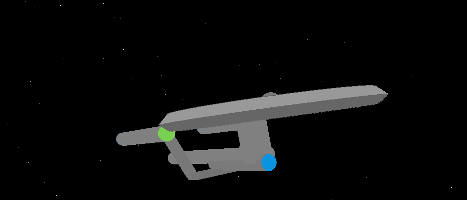

# Star Trek USS Yamaguchi study using OpenGL

This project is a study in 3D modeling and animation of the USS Yamaguchi, developed in Python using OpenGL and PyGame/GLUT.
The goal is to explore the fundamentals of 3D rendering, geometric transformations, and camera/object animation in a simulated space environment.

---

## Requirements
Before running the project, make sure you have:
	•	Python 3.10 or higher
	•	All dependencies installed (easier with uv)

---

## Running the Project

To start the simulation, run:
```bash
python main.py
```

A window will open displaying the USS Yamaguchi rotating in space, with simple lighting and camera motion effects.

---

## Preview


